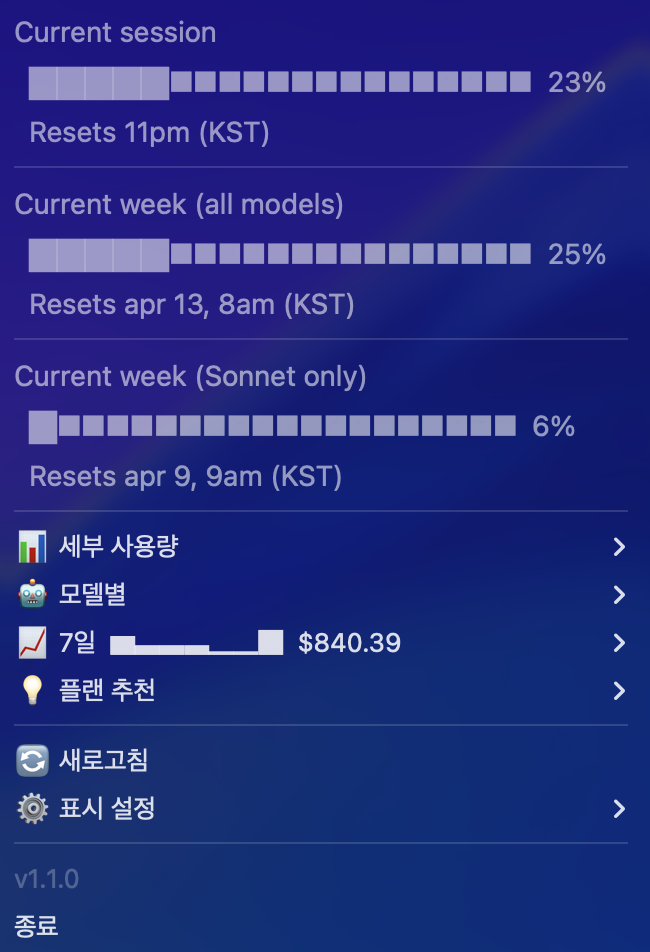
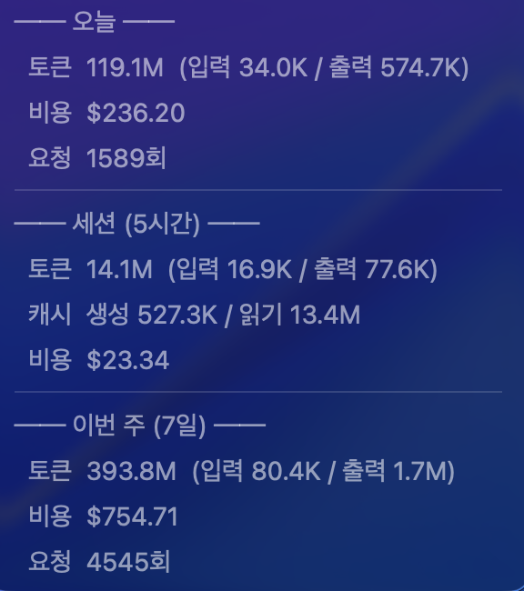
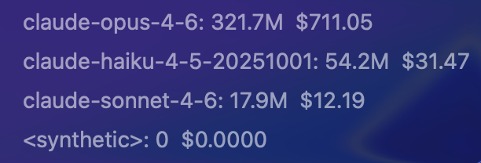
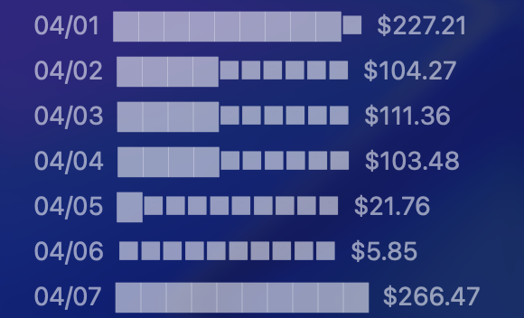
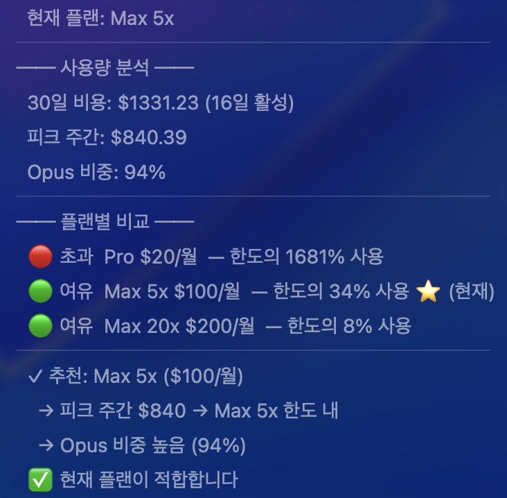
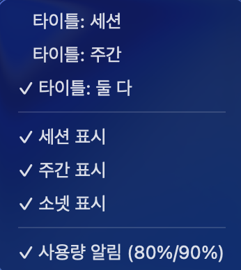

# Claude Code Usage Monitor

> macOS 메뉴바 / Windows 시스템 트레이에서 [Claude Code](https://docs.anthropic.com/en/docs/claude-code) 사용량을 실시간으로 모니터링하세요.
> `/usage` 명령어를 매번 치지 않아도, 한 눈에 확인할 수 있습니다.

  

<p align="center">
  
</p>

---

## 왜 만들었나요?

Claude Code를 쓰다 보면 **세션 한도에 갑자기 도달**하거나, **이번 주 사용량이 얼마나 남았는지** 감이 안 올 때가 많습니다.

이 앱은 메뉴바/트레이에 상주하면서:
- 세션·주간 사용량을 **프로그레스 바**로 보여주고
- 한도에 가까워지면 **알림**을 보내고
- 내 사용 패턴에 맞는 **플랜까지 추천**해줍니다.

---

## 주요 기능

### 실시간 사용량 대시보드
Anthropic API 연동으로 `/usage`와 동일한 데이터를 5분마다 자동 갱신합니다.
- 세션(5h), 주간(전 모델), 주간(Sonnet) 프로그레스 바
- 리셋 시각 표시 (KST)

### 세부 사용량
오늘, 세션(5시간), 이번 주(7일) 단위로 토큰, 비용, 요청 수를 상세하게 보여줍니다.

<p align="center">
  
</p>

### 모델별 사용량
어떤 모델에 토큰과 비용을 얼마나 쓰고 있는지 한눈에 확인할 수 있습니다.

<p align="center">
  
</p>

### 7일 사용량 히스토리
일별 비용 차트로 사용 패턴을 파악하세요.

<p align="center">
  
</p>

### 플랜 추천
30일 사용량을 분석해서 Pro / Max 5x / Max 20x 중 나에게 맞는 플랜을 추천합니다.

<p align="center">
  
</p>

### 사용량 알림
세션 또는 주간 사용량이 80%, 90%에 도달하면 시스템 알림으로 알려줍니다.

<p align="center">
  
</p>

### 표시 설정
메뉴바 타이틀, 표시 항목, 알림 등을 커스터마이즈할 수 있습니다.

<p align="center">
  
</p>

### 기타
- **OAuth 토큰 자동 갱신** — refresh token으로 만료 시 자동 갱신
- **자동 업데이트 확인** — 1시간마다 GitHub releases 확인
- **로그인 시 자동 시작** (선택)

---

## 설치

### 요구사항
- [Claude Code](https://docs.anthropic.com/en/docs/claude-code) 설치 및 로그인 완료

| | macOS | Windows |
|---|---|---|
| **OS** | macOS (Apple Silicon) | Windows 10/11 |
| **Python** | 3 | 3.8+ |

### macOS

**방법 1: 소스 설치**

```bash
git clone https://github.com/hmyanghm/claude-usage-menubar.git
cd claude-usage-menubar
./setup.sh
```

**방법 2: DMG 다운로드**

[Releases](https://github.com/hmyanghm/claude-usage-menubar/releases/latest)에서 최신 `.dmg`를 다운로드하세요.

**실행**

```bash
~/.claude-menubar/launch.sh
```

**로그인 시 자동 시작**

```bash
launchctl load ~/Library/LaunchAgents/com.claude.usage-monitor.plist
```

### Windows

```cmd
git clone https://github.com/hmyanghm/claude-usage-menubar.git
cd claude-usage-menubar
setup_windows.bat
```

설치 스크립트가 자동으로 의존성 설치, 파일 복사, (선택) 시작프로그램 등록을 처리합니다.

**실행**

```cmd
%USERPROFILE%\.claude-menubar\launch.bat
```

---

## 업데이트

| 설치 방법 | 업데이트 방법 |
|-----------|---------------|
| **Git clone** | `cd claude-usage-menubar && git pull` |
| **DMG / EXE** | [Releases](https://github.com/hmyanghm/claude-usage-menubar/releases/latest)에서 새 버전 다운로드 |

메뉴바에서 "업데이트 사용 가능" 알림을 클릭하면 릴리스 페이지가 열립니다.

---

## 동작 원리

OAuth 토큰(macOS: Keychain, Windows: 자격 증명 관리자)을 읽어 Anthropic Usage API를 호출합니다. 토큰/비용 상세는 `~/.claude/`의 로컬 JSONL 세션 파일에서 계산합니다. API 장애 시 로컬 추정치로 폴백합니다.

---

## 삭제

<details>
<summary>macOS</summary>

```bash
launchctl unload ~/Library/LaunchAgents/com.claude.usage-monitor.plist 2>/dev/null
rm -rf ~/.claude-menubar
rm -f ~/Library/LaunchAgents/com.claude.usage-monitor.plist
```

</details>

<details>
<summary>Windows</summary>

```cmd
rmdir /s /q %USERPROFILE%\.claude-menubar
del "%APPDATA%\Microsoft\Windows\Start Menu\Programs\Startup\Claude Usage Monitor.lnk"
```

</details>

---

## 트러블슈팅

<details>
<summary>Windows에서 OAuth 토큰을 찾지 못하는 경우</summary>

OAuth 토큰을 `~/.claude/.credentials.json` 파일에서 우선 읽고, 없으면 Windows 자격 증명 관리자를 fallback으로 사용합니다. Claude Code 로그인 후에도 토큰을 찾지 못하면:

1. **인증 파일 확인**: `%USERPROFILE%\.claude\.credentials.json` 파일이 존재하는지 확인
2. **자격 증명 관리자 확인**: 제어판 → 자격 증명 관리자 → Windows 자격 증명 → "Claude" 관련 항목 확인
3. 두 곳 모두 토큰이 없으면 [이슈](https://github.com/hmyanghm/claude-usage-menubar/issues)에 알려주세요.

</details>
